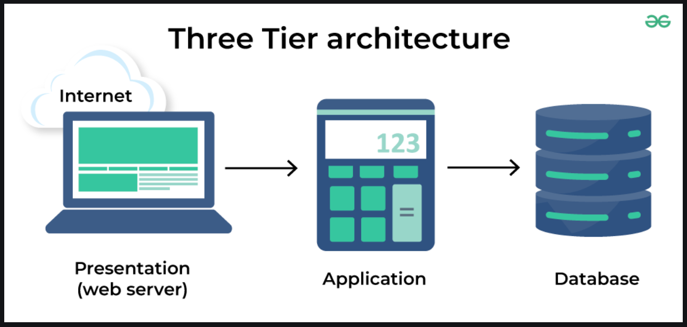
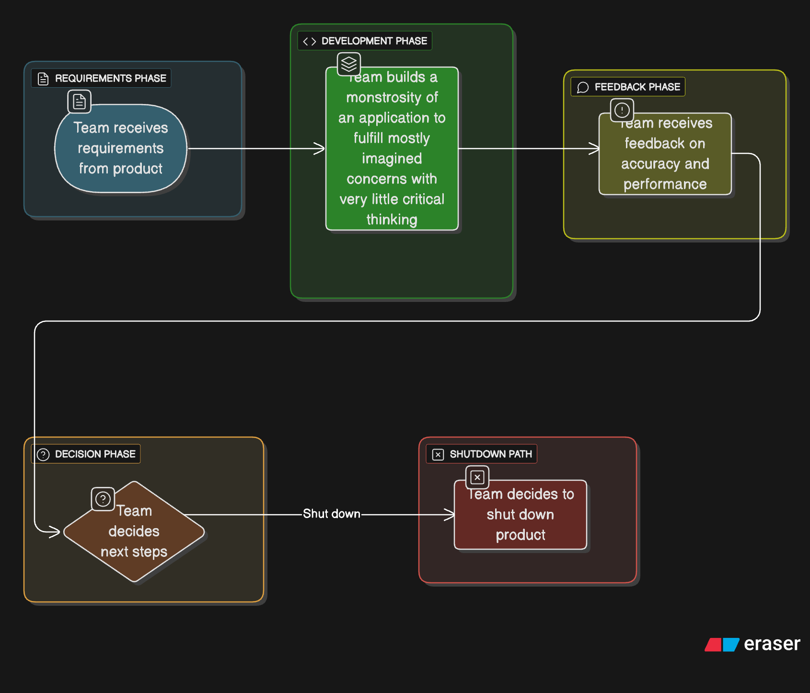

+++ 
date = "2025-12-31"
title = "Forgiving and unforgiving systems"
slug = "forgiving-unforgiving-systems" 
tags = []
categories = []
series = ["systems"]
+++

## Forgiving and unforgiving systems

In business, velocity of delivery and productivity is important. Recently, I have spent some time thinking about all the projects I’ve worked on and the varying levels of productivity achieved. I believe that one of the most important reasons for productivity or non productivity in software projects is whether the systems that you’re working with are “forgiving” or “unforgiving”. 

### Defining forgiving and unforgiving systems

**Forgiving Systems**

- Are ones where operator or builder errors do not prove so prohibitively expensive (in terms of money or time) that operators and builders need to spend the bulk of their time designing around the landmines in the system.
- Minimize cognitive complexity.
- Forgiving systems, once they get into a bad state, are easy to heal or even self-heal.
- Become easier to contribute to as builders and operators get more experience on them.

**Unforgiving Systems**

- Create high cognitive load on builders and operators and make integration designs more complex.
- Spread complexity to other systems that integrate with them.
- Do not make it particularly easier for builders and operators to contribute as they get more experience on them.

### How/why do teams and companies build unforgiving systems?**

I want to discuss how to build forgiving systems, but I think it is helpful to discuss why and how teams end up in situations where they build unforgiving systems. That will help us frame the environment needed for forgiving systems later.

The following is a narration of my experiences in a team that ended up building extremely unforgiving system:

A few years ago, I was on a team that was building a SaaS product that was intended to be whitelabeled and sold to specialized consulting firms, who would then sell it on to end customers. This was a product that did not have a validated thesis. In essence, the team did not know whether the product had a market and was trying to prove it. Product was told by the consulting firms that they were fairly confident that there was a market for the product and they needed a prototype to validate it with their own end customers. In retrospect, I feel this is the point where things started to go wrong. Instead of thinking scrappily and building a simple three tier application and validating our ideas, we decided to do something completely different instead.



During the time that we were building this application, the org was also trying to build two other SaaS applications for similar, but different domains. The org as a whole decided to mandate that these three applications must reuse any component that is remotely similar. This really was fodder for the [Merchants of Complexity](https://world.hey.com/dhh/merchants-of-complexity-4851301b) on the org to build castles of abstractions. Now, instead of an engineer designing and implementing an abstraction for their application, they would now need to consult with at least two other engineers from two other teams and verify if they had a need for something similar and then factor it into a reusable library. This led to endless meetings, design reviews, and status check ins to embellish the careers of the complexity merchants. We ended up with many interfaces/functions that looked something like the following:

```
{
	"field1": .... // needed by saas app 1
	"OptionaField2": ... // provided by saas app 2 sometimes
	"field2": ... // provided by saas app 1 and 2, but not 3
	"field3": ... // provided by saas app 3 and 2, but not 1
}
```

Any update to these shared functionalities now necessarily required cross team synchronization and consensus. Simple things became hard, hard things became almost impossible. Things moved like molasses.

> [A little copying is better than a little dependency.](https://www.youtube.com/watch?v=PAAkCSZUG1c&t=9m28s) - Rob Pike

There were other problems as well. The Org and it’s consulting partners had a very maximalist approach to design. They assumed a high level of product success and built for that, even though the product was un validated and there was zero certainty about traction. An example of this is when the consulting partners were adamant that their data should be kept separately from other consulting partners in completely separate infrastructure and database tables. This was yet more fodder for the `Merchants of Complexity` . The merchant guild built an elaborate scaffolding and orchestration mechanism for spinning up a copy of the service for each new onboarded partner. Now, instead of having a single set of infra to reason about, you had many. In addition, you also had to reason about why the orchestration infra behaved the way it did. 

1. Why did deployment X for test tenant Y fail? Take a look at logs spread out over seemingly gazillion services.
2. Engineer 1: How do I update all the consulting tenant/partner stacks?
    
    Complexity merchant: Update each partner stack by going to it.
    
    Engineer 2: Is there a faster way to do it?
    
    Complexity merchant: Yea, we’re designing it, it’ll be available in Q3. Until then, you’re on your own.

Let’s sum up the mistakes this org made that led to them building such a slow moving unforgiving system:

1. Prematurely abstracting
    1. Good abstractions emerge from observing patterns that exist and encoding them.
    2. If you try to create abstractions by anticipating patterns based on your guesses, they’ll almost certainly be wrong and the interfaces will be clunky and hard to understand.
2. Building for a level of success that was not certain
    1. The teams that operate at a large scale often evolve their system organically to meet increasing demand. They usually start with scrappy systems and evolve them over time for their increasing adoption.
    2. Assuming crazy success on day 1 and building for it without evidence will lead to unnecessarily overcomplicated systems that will actually slow down your value delivery to customers.

Visually expressed, this is what we did:


We spent years building these systems, so what happened? Did we get rip roaring success? Surely, the orchestration mechanisms and reusable abstractions must’ve helped handle the thousands of new customers that surely must’ve flocked to use our application right?

After years of building, our initial consulting partners finally got their hands on what we had built. The feedback was not good. The product had issues with performance, correctness, etc. Slowly, the products started getting shut down. First, one SaaS product, then another, then finally the third one. Eventually, the whole product line was shut down. All the reusable abstractions were for naught. The multi tenant isolation/deployment/orchestration was never used for an actual paying customer.

Now, let’s talk about how the team could’ve validated their products without spending years of our lives on what was essentially a dead end:

1. Build scrappily and get the product into customer hands fast
    1. Do not build for 1000s of customers, but for just one or two.
2. Do not build shared abstractions unless entirely necessary.
    1. Good abstractions will emerge from contact with reality and can be adopted later.
3. Do not prematurely optimize.
4. Be scrappy (re stated for emphasis).

Now, let’s get a bit more concrete and see how this could’ve saved the team a bunch of time, money, and resources. Let’s imagine a scenario where the team did not make the decisions it did and decided to take a different route.


In the above scenario, the team could’ve made contact with reality much faster, in months rather than years and could’ve then chosen to spend it’s resources on either improving the core product or shutting it down earlier to save those resources for other projects.